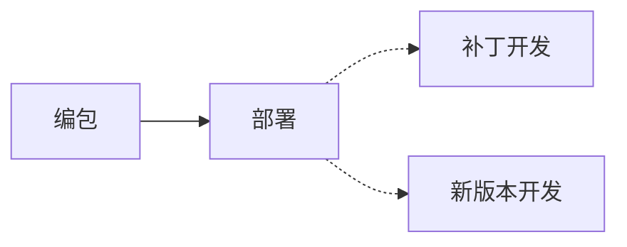
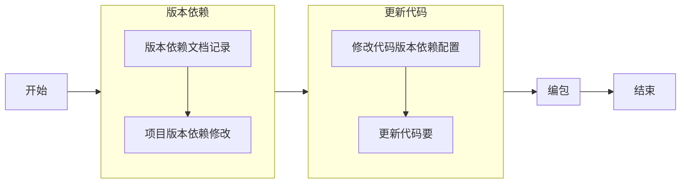
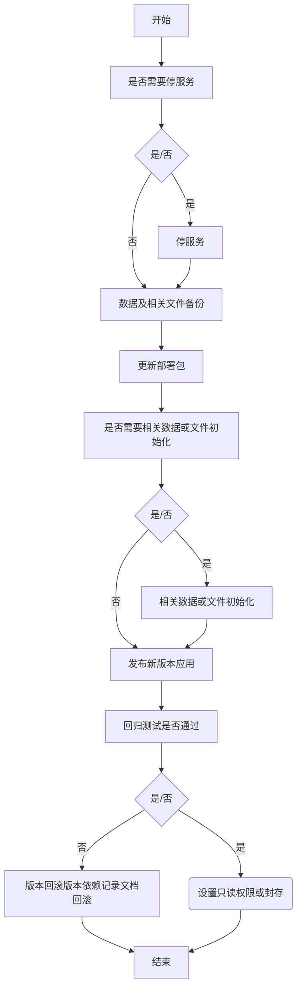
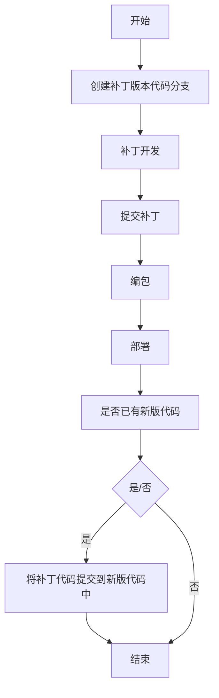

# 一、概述
# 1.1、整体说明

# 二、部署发布
## 2.1、编包

### 2.1.1 版本依赖记录文档
| 项目名 | 上一版本 | 当前版本 | 修改日期 | 修改人 | 影响范围 | 影响说明 |
| :- | - | - | - | - | - | - |
| 项目1 | v1.0.0 | v1.0.1 | 2022-01-05 | Vinson | 受影响的项目及功能模块 | 影响详细说明 |

## 2.2、部署

## 2.3、补丁开发

# 三、注意点
1、要保证版本依赖记录的正常更新
2、版本功能清单及功能说明记录
3、功能影响范围及说明
4、注意新版本代码要注意补丁版本的代码是否需要包含，如果需要包含，不可遗漏

